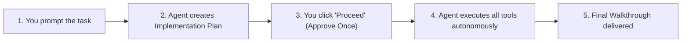

# 🧭 Antigravity Master Architecture Guide & Cheatsheet

A complete reference for workspace structure, active MCP servers, skills, execution settings, and workflows.

---

## 📍 Primary System Locations

| Component | Location | Notes |
| :--- | :--- | :--- |
| **Primary Project Workspace** | `c:\Users\cary\gravity` | Synced to GitHub repository |
| **GitHub Repository** | `https://github.com/jklivinatx/antigravity` | Connected on branch `main` |
| **Active Obsidian Vault** | `C:\Users\cary\iCloudDrive\iCloud~md~obsidian\Wobsidian` | iCloud-synced markdown vault |
| **Downloads Target** | `C:\Users\cary\Downloads` | Destination for media & exports |
| **Global MCP Configuration** | `C:\Users\cary\.gemini\config\mcp_config.json` | Active across all projects |
| **Python Environment** | `C:\Python314\python.exe` | System Python with `yt-dlp`, `mcp`, `ddgs` |

---

## 🛠️ Configured MCP Servers Suite

All MCP servers are globally registered in `~/.gemini/config/mcp_config.json` and available in every conversation:

### 1. `github` (Authenticated)
- **Engine:** `@modelcontextprotocol/server-github` via Node.js
- **Capabilities:** Create & review PRs, inspect commit history, manage issues, commit files directly via GitHub API.

### 2. `obsidian` (Active iCloud Vault)
- **Script:** [`scripts/obsidian_mcp_server.py`](scripts/obsidian_mcp_server.py)
- **Target Vault:** `C:\Users\cary\iCloudDrive\iCloud~md~obsidian\Wobsidian`
- **Tools:**
  - `search_vault_notes(query)`: Search all vault markdown files with snippets.
  - `read_vault_note(note_name)`: Read full note content.
  - `create_or_append_note(title, content, folder, append)`: Create or append formatted notes.

### 3. `readwise` (Authenticated)
- **Script:** [`scripts/readwise_mcp_server.py`](scripts/readwise_mcp_server.py)
- **Tools:**
  - `get_books(category)`: List saved books, articles, podcasts, or tweets.
  - `get_highlights(book_id, query)`: Search and extract highlights.

### 4. `job-search` (LinkedIn, Indeed & Google Jobs)
- **Script:** [`scripts/job_search_mcp_server.py`](scripts/job_search_mcp_server.py)
- **Tools:**
  - `search_linkedin_jobs(keywords, location, count)`: Free public guest search on LinkedIn (no API key/login needed).
  - `search_indeed_jobs(keywords, location, count)`: Current Indeed job postings.
  - `search_google_jobs(keywords, location, count)`: Broader web careers and Google Jobs results.

### 5. `duckduckgo-search` (Free Live Search)
- **Script:** [`scripts/ddg_mcp_server.py`](scripts/ddg_mcp_server.py)
- **Tool:** `search(query, max_results)`: Fast, keyless real-time web search.

### 6. `puppeteer` (Browser Automation)
- **Engine:** `@modelcontextprotocol/server-puppeteer`
- **Capabilities:** Headless browser navigation, form fills, button clicks, dynamic page scraping.

### 7. `fetch` (Markdown Converter)
- **Engine:** `@modelcontextprotocol/server-fetch`
- **Capabilities:** Converts web pages and articles into clean Markdown.

### 8. `sqlite` (Local Database)
- **Database Path:** `C:\Users\cary\gravity\workspace.db`
- **Capabilities:** SQL queries, tables, and structured data logs.

### 9. `filesystem` (Drive Access)
- **Allowed Paths:** `gravity`, `Downloads`, `Wobsidian`.

---

## ⚡ Interaction & Execution Model



### Ideal Settings Checklist (Settings ⚙️)
- **Security Preset:** `Always Proceed` *(No pausing on individual terminal commands)*
- **Artifact Review Policy:** `Always Ask` *(Pauses on the Implementation Plan so you review once)*
- **File Permissions:** `Allow` *(Can write directly to Downloads and iCloud)*
- **Network Permissions:** `Allow` *(Outbound search and scraping enabled)*

---

## 📦 Custom Workspace Skills & Workflows

### YouTube MP3 Downloader Skill
- **Path:** [`.agents/skills/youtube-mp3-downloader/SKILL.md`](.agents/skills/youtube-mp3-downloader/SKILL.md)
- **Helper Script:** [`scripts/download_convert.py`](.agents/skills/youtube-mp3-downloader/scripts/download_convert.py)
- **Usage:** Just paste a YouTube URL and ask to download as MP3.

### NYRR Job Scraper
- **Script:** [`job-query/fetch_nyrr_jobs.py`](job-query/fetch_nyrr_jobs.py)
- **Doc:** [`job-query/nyrr_job_openings.md`](job-query/nyrr_job_openings.md)

---

## 🔄 Useful Git Commands

Sync your local `gravity` repo with GitHub anytime:

```powershell
cd c:\Users\cary\gravity

# Check status
git status

# Stage & commit changes
git add .
git commit -m "Update notes and scripts"

# Push to GitHub
git push -u origin main
```
